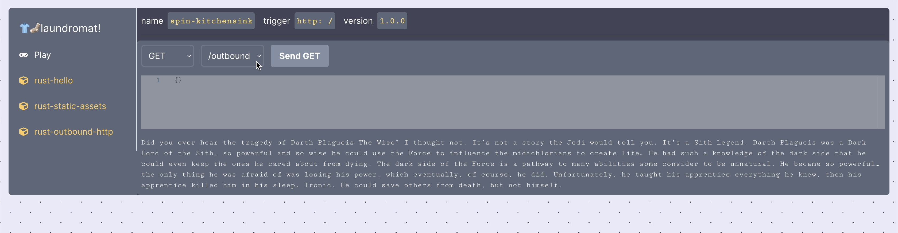
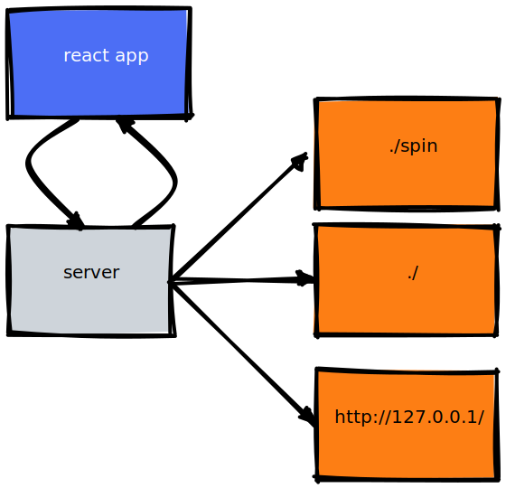

# Laundromat

An indev console for Spin apps.

## Server breakdown

 - A React app is built into the binary
 - The React app reaches out to the server for resources
 - It reads the current directory for Spin app configuration
 - It reads the Spin home directory for log output
 - It proxies requests to the spin app that's running

## How to use

Just `cd` into your Spin app, run it with `spin up` and run `laundromat` in a separate tty.

## How to build

1. `yarn build`
2. `cd server && cargo build --release`
3. `mv ./target/release/laundromat /usr/local/bin`
